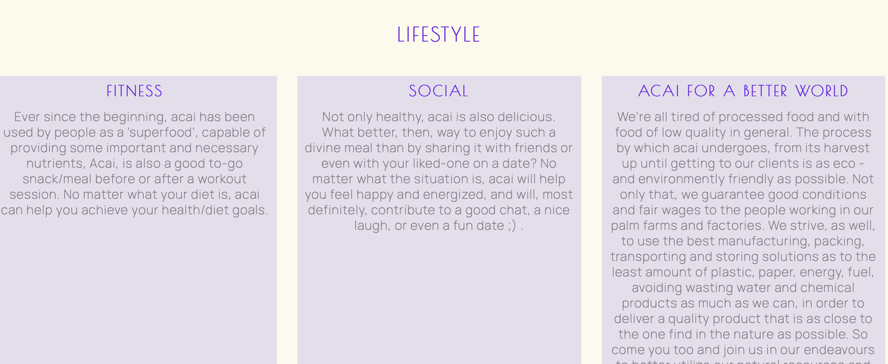
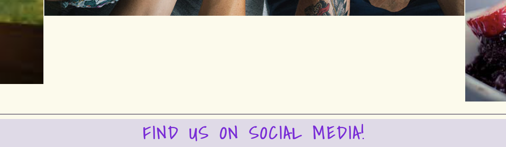

# Acai-Pwr
 Acai Pwr is a website that was made to provide users with more information about Acai (a Brazilian fruit that grows in the Amazon), the things we can do with it and the benefits of such thing, hoping to get as many people s possible to get to know this amazing fruit. Obviously, it has as target audience everyone that’s looking for a fit life and/or a food to complement their diet and healthy lifestyle, be that after a gym session or in a moral social setting. 

The website is intended as a static front end application that’s easy to navigate, user friendly and is clear in purpose. In the contact form, users can be redirected to a sign up page where, by providing their details, they can be sent more information on products, recipes, event and gatherings created, hosted and organised by us/our community.

You can view the deployed website [here]().

## Features
Initially these were the features that I wanted to implement on the website. Some I could, and others, unfortunately I couldn't due to the lack of time and my yet inexperience in building websites in a due and timely manner.

- An easy to navigate nav bar, where users could be easily redirected to what they were looking for.
- Sections with enough content explaining what acai is and its benefits to those who eat it.
- A gallery with inspiring recipes, settings and situations where acai could be used, thus providing a healthy to-go snack.
- A contact form so that users could get in touch with our community and receive more information on acai, products, recipes and events.
- Social links in the footer of page for the user to follow the it on different social medias and be up to date with the latest information about the community. 
Future features the website will contain:
- A page detailing different Acai products where users could buy
- A page for a future store in Greystones, co. Wicklow
- Testimonials from other users

Layout and content: The content is divided in 5 parts: the About section, explaining more about acai, where it comes from and the uses/benefits from introducing it to one’s diet, short after there’s the uses section where it’s given some ways or recipes acai can be used  in, another image of a baby eating acai to highlight that it’s healthy enough even to give it to kids, but also to contrast from the amount of text and at the same time capture the user’s attention on more time; the Lifestyle section shows some of the lifestyles that where acai can fit in or in what contexts acai can put in for a perfect social/fitness combination; the Gallery section is another representation of how acai fits in different contexts and how different people eat it/use it in different settings and with different goals in mind

### Existing Features

 - #### The Navegation Bar and Logo
   - Present in both the main page and contact page, it takes the user to all different sections and contents of the page and between the cintact and home pages. It presents the Logo and the links to the Home Page, to the About, Uses, Lifestyle and Gallery sections, as well as to the Contact page.

   ![Navegation Bar and Logo]
   (readme-images/navbar-logo.png)

  - #### Main (Hero) Images
    - To capture the user’s attention with a professional feel and at the same time introduce them to acai two main images were used: one highliting its origin and the other the most renowned product made from it, the acai bowl.

  .

  - #### About Section
    - The about section has as its purpose explaining more about acai, where it comes from, some of the history behind it, as well as some of the benefits associated with it. 
    - It contains two main boxes explaining both why it is considered a superfruit and a little about its history and how it became so popular.
    - The section also has a beautiful top-part of an acai bowl in black-and-white as the background image for it, creating a nice contrast between the text and the image, and the colorful images above and the section itself.

  .

  - #### Ways You Can Use It (Recipes) Section
    - `This may be the most practical and the most recognizeable section of the entire webpage.
    - Here we can found some of the common ways acai is used and the practicalities, benefits if you will, of each. This section also contained some accompanying images to better describe each of the uses it mentions.

  .

  - #### Break Off Image 
   - The break off image was intented to be a break between the two text sections with a more relaxing feel to it.

  .

  - #### Lifestyle Section 
    - This section explains a little bit more in detail some of the settings acai is more commonly found, as well as some other situations it can be eaten in. 
    - This section explains a little further how people looking for a more fit and healthy life and for a more healthy alternative of a snack/meal when going out with friends, and, further, how the production and comsumption of acai helps our communities be more sustainable.

  .

  - #### Gallery
    - The gallery was intented as being the 'final touch' on the main webpage. 
   - It provides some visual references to the settings  and situations mentioned in the section above.

  .

  - #### Contact Page 
   - The contact page explains more in detail how to receive more news and updates about recipes, acai, meetings and acai related content in general from and how to stay in contact with the community.
    - The form section containes some fields where, by filling it out, allows the user to be added to the pages database and they can, then, be added to the email list.

  

  - #### Footer 
    - It contains another contact link redirecting the user to the contact page, to all the social medias where the page is present where they can follow the page and be on top of the new content posted on there, and the copyrights of the brand.

.

### Features Left to Implement
   - Adding a location and more contact information, such as email, phone number, and an opening time information for the future store.
   - A page with specific products to be sold by the brand.
   - A more responsive design/layout to smaller screen sizes (as explained in the bugs and issues session below).
   - Another page with more detailed recipes of smoothies and bowls.
   - Videos explaining more about the recipes and acai itself.
   - Testiomonials section.

## UX
    - The website was designed as to be as user friendly as possible and present/convey the information and content in a way as it is both easy to be understood and to be found. 
    - The images are used to describe more visually what acai actually is and what is used for, as well as to be something more identifiable to the user.
    - The colors were used both to reflect the colors of acai (purple-bordeaux-like) and what it can bring (happines and excitement, represented by the color yellow, often associated with sun and beach).
  
  ### Design Choices

  - #### Color Scheme 

    - #fcfaeb - color used as the background as for its yellow-happy-ish feel and as the text for the black-and-white 'about section' .
    - #8518de - a more dark purple color used for both the logo and for the phrase on the footer.
    - #7215eb - another shade of purple used for the the less important headings.
    - #817887 - middle shade of purple used for the main sub-headings.
    - #e0dae8 - shade of grey-purple used for the navegation bar menu options and to bee used in the text.
    - rgba(0, 0, 0, 0.6) - black-see-through background color for the boxes in the 'about section'.
    - rgb(228, 223, 235) - shade of light purple used as the background colors for the boxes in both the ;ways you can use it' and 'lifestyle' sections.

  - #### Typography/Fonts

    - Manrope - main font used both for the navegation bar and for the body text.
    - Shadows into Light - font utilized for the logo and the catchy phrase on the footer section.
    - Poiret One - font used for the subheadings.

  ## Testing

  The website  has been tested as to comply with best practices and reach a high performance.

  The site was tested in different devices as to assess its responsiveness and functionability in different screen sizes. Iphone, Ipad, Ipad Pro, Macbook Pro 13-inch, Macbook Pro 16-inch, and Imac were all used to assess how good the website worked and it functioned well, except for a bug when it came down to smaller screen sizes as will be detailed with more details below. 

  - ### HTML 
    - No errors were found when passing through the official W3C validator.

    .

  - ### CSS
    - No errors were found when passing through the official (Jigsaw) W3C validator.

    .

  - ### Lighthouse 
    - Lighthouse was also used to assess the website and the results came back satisfactory. The reason why the performance was lower than expected was due to the high volume and sizes of images that were uploaded, but to keep the high quality when applying it to bigger screen sizes, bigger size images were chosen, which led to the website to perform a little worse in the regard of loading images fast, but not to a point where that becomes a problem or the website lags because of it.

   .

## Bugs and issues
- Due to some CSS complexity, and without any explanation for it or specific code to explain the behavior, when it came to smaller sizes the website presented a weird left/right margin that was completely unintended; however, in a way and in some sections, it did add to the style of the page.

.

.

.

- Mainly because the images weren't compressed/adjusted before being uploaded, in some important areas there is a minimal discrepancy in layout as shown above. As explained above, that could have easily been avoided/fixed, but for quality purposes it was chosen to keep them as they were and adjust the layout of the page around it.

.

.

.

## Credits
- ### Content
  - Mostly all content was created from the author's knowledge on the fruit itself, however some things about the history, production and the benefits of consuming it were found on different sources on Google. Some of the links (that actually contributed to the content of the website) can be found below:
    - [Link 1]().
    - [Link 2]().
    - [Link 3]().

- ### Media
  - As this is a very specific subject, the images had to be searched for on Google as wel. A whole list for the link for the images in the order as they were used on the website can be found [here]().

- ### Coding
  - Most of the coding ideas and knowledge was taken from the Code Institute Library, videos, and lessons, but some coding was also obtained by consulting with tutors, my mentor Reuben Ferrante and inspired from the Love Running Project, also from Code Institute.
  - Free Code Camp, W3School, Kevin Powell, and Bootstrap, both on their Youtube channels and websites, were also used as sources of inspiration and go-to-when-you're-stuck resources for the coding used in the project.
  - The font used was taken from Google Fonts.
  - The icons used for the social media platforms in the footer were taken from Font Awesome.
  - The colors were obtained on Google as well.

## Deployment
- ###The site was deployed to GitHub pages. The steps to deploy are as follows:
  - In the GitHub repository, go to the Settings tab.
  - From the source section drop-down menu, select the Master Branch.
  - Once the master branch has been selected, the page will be automatically refreshed with a message indicating the deployment has been successful.

  The live link can be found above, or alternatively [here]().

